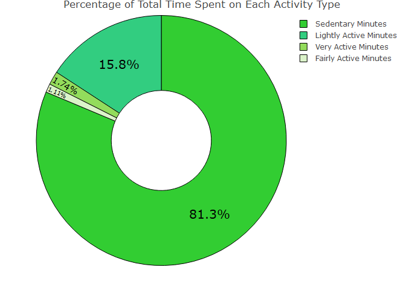
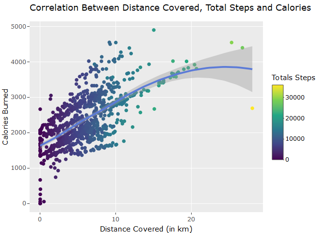
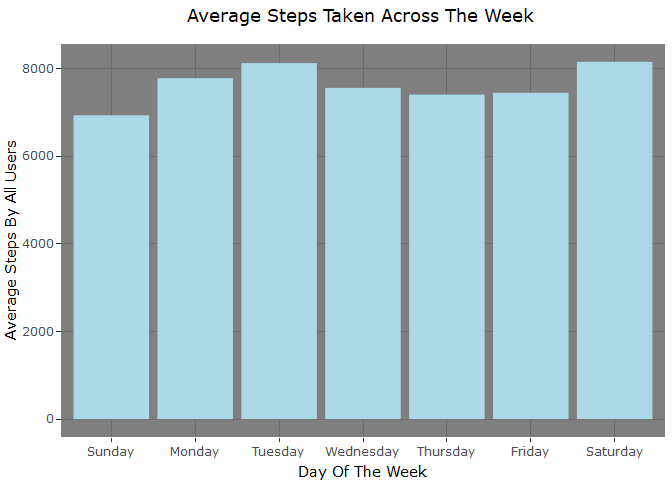
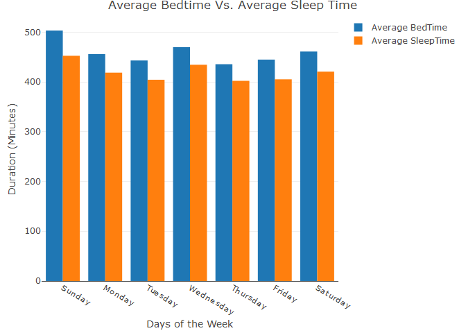
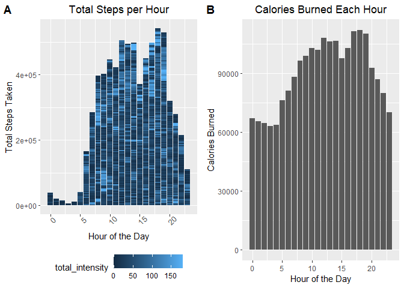
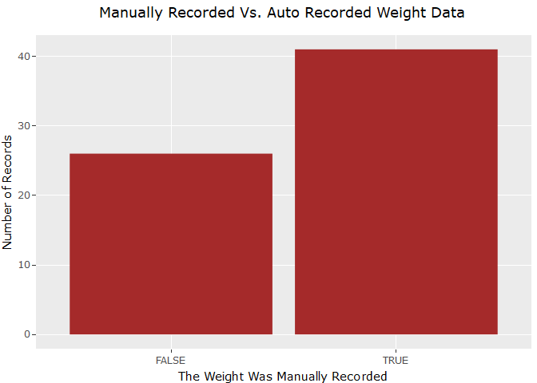
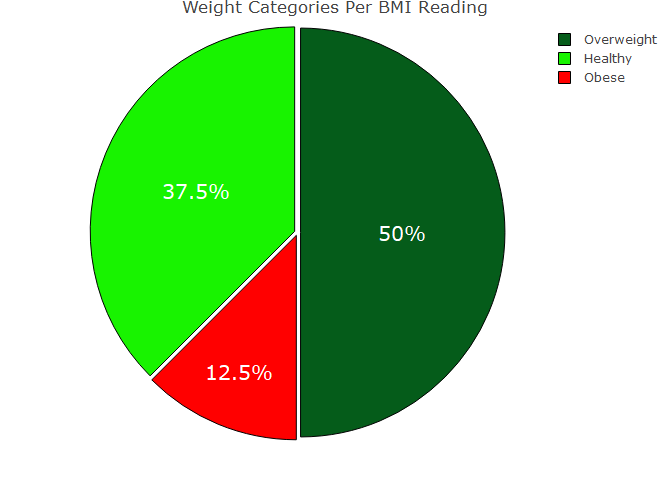

# Bellabeat Fitness Data Analysis 

#### Gideon Osei Bonsu
#### 2023-08-12

---

# 

This is my final project for the Google Data Analytics Professional
Certificate course. Throughout this project, I will be following the
data analysis cycle, which consists of the Ask, Prepare, Process, Analyze, Share and
Act phases.

### *SCENARIO*

Assuming the position of a junior data analyst, I am working on the
marketing team of Bellabeats, a high-tech manufacturer of health-focused
products for women. The company’s offerings include a membership plan,
the Bellabeats app, the “Leaf” tracker, the “Time” watch and the
“Spring” water bottle, all measuring essential parts of users’ daily
activity to help them make wise decisions relating to stress management,
sleep, menstrual cycle, among others. Having already positioned itself
as a rapidly growing tech-driven wellness company for women, the company
seeks to explore new opportunities for growth by analyzing similar smart
device users’ fitness data for insights. I have been tasked with
delivering these insights.

### *KEY STAKEHOLDERS*

1.  Urška Sršen: Bellabeat’s cofounder and Chief Creative Officer
2.  Sando Mur: Mathematician and Bellabeat’s cofounder, also a key
    member of the Bellabeat executive team.
3.  Bellabeat Marketing Analytics team +I am working as a junior data
    analyst under this team

------------------------------------------------------------------------

# *PHASE 1: THE ASK*

Sršen asks me to analyze smart device usage data in order to gain
insight into how consumers use non-Bellabeat smart devices. She wants me
to select one Bellabeat product to apply these insights to in my
presentation. 
The guiding questions are: 
1. What are some trends in smart device usage?
2. How could these trends apply to Bellabeat
customers?
3. How could these trends help influence Bellabeat marketing
strategy?

### *EXPECTATIONS*

1.  A clear summary of the business task
2.  A description of all data sources used
3.  Documentation of any cleaning or manipulation of data
4.  A summary of your analysis
5.  Supporting visualizations and key findings
6.  Your top high-level content recommendations based on your analysis

------------------------------------------------------------------------

# *PHASE 2*


Sršen recommends using the FitBit Fitness Tracker Data found on
**[Kaggle](https://www.kaggle.com/datasets/arashnic/fitbit)**. 30
eligible Fitbit users consented to submit their personal tracker data,
including minute-level output for physical activity, heart rate, and
sleep monitoring. It also includes information about daily activity,
steps, and heart rate that can be used to explore users’ habits.

### *Dataset Limitations*

1.  A sample size of 30 may not accurately reflect trends from entire
    population of smart fitness device users.
2.  The data was collected in 2016 and thus, may not accurately depict
    current user trends.
3.  Having been collected via a third party survey, we are unsure of
    data integrity.

***Reading Datasets***

``` r
daily_activity <- read.csv("Datasets/dailyActivity_merged.csv")
sleep_pattern <- read.csv("Datasets/sleepDay_merged.csv")
hourly_calories <- read.csv("Datasets/hourlyCalories_merged.csv")
hourly_intensities <- read.csv("Datasets/hourlyIntensities_merged.csv")
hourly_steps <- read.csv("Datasets/hourlySteps_merged.csv")
hourly_data <- cbind(hourly_intensities,Calories=hourly_calories$Calories)
hourly_data <- cbind(hourly_data,TotalSteps=hourly_steps$StepTotal)
weight <- read.csv("Datasets/weightLogInfo_merged.csv")
```

------------------------------------------------------------------------

# *PHASE 3*


***Install Packages and Load Libraries***
``` r
install.packages(c("dbplyr", "tidyverse", "janitor","plotly", "cowplot"))
library(tidyverse)
library(dplyr)
library(janitor)
library(lubridate)
library(cowplot)
library(ggplot2)
library(plotly) 
```

After loading our data, needed packages and libraries, we now want to
see how the data looks like, we are working with the daily_activity
dataset first and we will start by ***checking for null values in each
column.***

``` r
daily_activity %>%
  summarise(across(everything(), ~ sum(is.na(.))))
```

    ##   Id ActivityDate TotalSteps TotalDistance TrackerDistance
    ## 1  0            0          0             0               0
    ##   LoggedActivitiesDistance VeryActiveDistance ModeratelyActiveDistance
    ## 1                        0                  0                        0
    ##   LightActiveDistance SedentaryActiveDistance VeryActiveMinutes
    ## 1                   0                       0                 0
    ##   FairlyActiveMinutes LightlyActiveMinutes SedentaryMinutes Calories
    ## 1                   0                    0                0        0

Also, we want to ***confirm that indeed 30 users responded to the
survey*** as claimed, and check the ***structure of the columns in the
dataset.***

``` r
print(paste0("Unique User Id's: ", length(unique(daily_activity$Id))))
```

    ## [1] "Unique User Id's: 33"

``` r
str(daily_activity)
```

    ## 'data.frame':    940 obs. of  15 variables:
    ##  $ Id                      : num  1.5e+09 1.5e+09 1.5e+09 1.5e+09 1.5e+09 ...
    ##  $ ActivityDate            : chr  "4/12/2016" "4/13/2016" "4/14/2016" "4/15/2016" ...
    ##  $ TotalSteps              : int  13162 10735 10460 9762 12669 9705 13019 15506 10544 9819 ...
    ##  $ TotalDistance           : num  8.5 6.97 6.74 6.28 8.16 ...
    ##  $ TrackerDistance         : num  8.5 6.97 6.74 6.28 8.16 ...
    ##  $ LoggedActivitiesDistance: num  0 0 0 0 0 0 0 0 0 0 ...
    ##  $ VeryActiveDistance      : num  1.88 1.57 2.44 2.14 2.71 ...
    ##  $ ModeratelyActiveDistance: num  0.55 0.69 0.4 1.26 0.41 ...
    ##  $ LightActiveDistance     : num  6.06 4.71 3.91 2.83 5.04 ...
    ##  $ SedentaryActiveDistance : num  0 0 0 0 0 0 0 0 0 0 ...
    ##  $ VeryActiveMinutes       : int  25 21 30 29 36 38 42 50 28 19 ...
    ##  $ FairlyActiveMinutes     : int  13 19 11 34 10 20 16 31 12 8 ...
    ##  $ LightlyActiveMinutes    : int  328 217 181 209 221 164 233 264 205 211 ...
    ##  $ SedentaryMinutes        : int  728 776 1218 726 773 539 1149 775 818 838 ...
    ##  $ Calories                : int  1985 1797 1776 1745 1863 1728 1921 2035 1786 1775 ...

***Key Observations Thus Far:***

- The daily_activity dataset has 15 columns and 940 rows.
- There are no null values in any of the columns.
- Values in all the columns are in the correct format, except for the
  ActivityDate column, which is formatted as a character (chr) type,
  instead of Date.
- 33 users responded to the survey, instead of the expected 30. We will
  have to investigate why this it.
- We may want to rename the columns for a cleaner look.

Having made these observations, we will now go ahead and clean the data.

***Change ActivityDate column to Date format***
```{r echo=FALSE}
daily_activity$ActivityDate <- mdy(daily_activity$ActivityDate)
```

We will now ***clean column names*** easily with the clean_names
function from the janitor package

``` r
daily_activity=clean_names(daily_activity)
colnames(daily_activity)
```

    ##  [1] "id"                         "activity_date"             
    ##  [3] "total_steps"                "total_distance"            
    ##  [5] "tracker_distance"           "logged_activities_distance"
    ##  [7] "very_active_distance"       "moderately_active_distance"
    ##  [9] "light_active_distance"      "sedentary_active_distance" 
    ## [11] "very_active_minutes"        "fairly_active_minutes"     
    ## [13] "lightly_active_minutes"     "sedentary_minutes"         
    ## [15] "calories"

We are done with the preliminary data cleaning. We will now go ahead and
manipulate the data to fine-tune it even more.

***Extract days from the dates***

``` r
day <- wday(daily_activity$activity_date, label = TRUE, abbr = FALSE)
daily_activity <- daily_activity %>%
  mutate(day)
str(daily_activity)
```

    ## 'data.frame':    940 obs. of  16 variables:
    ##  $ id                        : num  1.5e+09 1.5e+09 1.5e+09 1.5e+09 1.5e+09 ...
    ##  $ activity_date             : Date, format: "2016-04-12" "2016-04-13" ...
    ##  $ total_steps               : int  13162 10735 10460 9762 12669 9705 13019 15506 10544 9819 ...
    ##  $ total_distance            : num  8.5 6.97 6.74 6.28 8.16 ...
    ##  $ tracker_distance          : num  8.5 6.97 6.74 6.28 8.16 ...
    ##  $ logged_activities_distance: num  0 0 0 0 0 0 0 0 0 0 ...
    ##  $ very_active_distance      : num  1.88 1.57 2.44 2.14 2.71 ...
    ##  $ moderately_active_distance: num  0.55 0.69 0.4 1.26 0.41 ...
    ##  $ light_active_distance     : num  6.06 4.71 3.91 2.83 5.04 ...
    ##  $ sedentary_active_distance : num  0 0 0 0 0 0 0 0 0 0 ...
    ##  $ very_active_minutes       : int  25 21 30 29 36 38 42 50 28 19 ...
    ##  $ fairly_active_minutes     : int  13 19 11 34 10 20 16 31 12 8 ...
    ##  $ lightly_active_minutes    : int  328 217 181 209 221 164 233 264 205 211 ...
    ##  $ sedentary_minutes         : int  728 776 1218 726 773 539 1149 775 818 838 ...
    ##  $ calories                  : int  1985 1797 1776 1745 1863 1728 1921 2035 1786 1775 ...
    ##  $ day                       : Ord.factor w/ 7 levels "Sunday"<"Monday"<..: 3 4 5 6 7 1 2 3 4 5 ...

We can see that the data now has 16 columns, this is because I have
added a column for the particular day of the week each date was. But
that gives us another problem; the “day” column is the last of all the
columns, but ideally we would want it to be next to the “activity_date”
column for better understanding.

***Relocate the “day” column***

``` r
daily_activity <- daily_activity %>%
  relocate(day, .after = activity_date)
```

***Create a new totals column for all activity minutes***

``` r
daily_activity <- daily_activity %>%
  mutate( total_logged_mins = fairly_active_minutes+very_active_minutes+sedentary_minutes+lightly_active_minutes)
```

***Create a column for total hours***

``` r
daily_activity['total_logged_hours'] <- round(daily_activity$total_logged_mins/60)

daily_activity <- daily_activity %>%
  relocate(total_logged_mins, .before = calories) %>%
  relocate(total_logged_hours, .before = calories)
head(daily_activity)
```

    ##           id activity_date       day total_steps total_distance
    ## 1 1503960366    2016-04-12   Tuesday       13162           8.50
    ## 2 1503960366    2016-04-13 Wednesday       10735           6.97
    ## 3 1503960366    2016-04-14  Thursday       10460           6.74
    ## 4 1503960366    2016-04-15    Friday        9762           6.28
    ## 5 1503960366    2016-04-16  Saturday       12669           8.16
    ## 6 1503960366    2016-04-17    Sunday        9705           6.48
    ##   tracker_distance logged_activities_distance very_active_distance
    ## 1             8.50                          0                 1.88
    ## 2             6.97                          0                 1.57
    ## 3             6.74                          0                 2.44
    ## 4             6.28                          0                 2.14
    ## 5             8.16                          0                 2.71
    ## 6             6.48                          0                 3.19
    ##   moderately_active_distance light_active_distance sedentary_active_distance
    ## 1                       0.55                  6.06                         0
    ## 2                       0.69                  4.71                         0
    ## 3                       0.40                  3.91                         0
    ## 4                       1.26                  2.83                         0
    ## 5                       0.41                  5.04                         0
    ## 6                       0.78                  2.51                         0
    ##   very_active_minutes fairly_active_minutes lightly_active_minutes
    ## 1                  25                    13                    328
    ## 2                  21                    19                    217
    ## 3                  30                    11                    181
    ## 4                  29                    34                    209
    ## 5                  36                    10                    221
    ## 6                  38                    20                    164
    ##   sedentary_minutes total_logged_mins total_logged_hours calories
    ## 1               728              1094                 18     1985
    ## 2               776              1033                 17     1797
    ## 3              1218              1440                 24     1776
    ## 4               726               998                 17     1745
    ## 5               773              1040                 17     1863
    ## 6               539               761                 13     1728

Data Cleaning and Manipulation on the daily_activity dataset is done. We
will now turn our attention to the sleep_pattern and hourly_data
datasets.

Convert the SleepDay column to Date data type, Clean column names, check
for null values, as well as number of unique users to log sleep data and
hourly data.
**There are null values in the sleep_pattern dataset: FALSE**
``` r
sleep_pattern$SleepDay <- mdy(sleep_pattern$SleepDay)
sleep_pattern = clean_names(sleep_pattern)
hourly_data = clean_names(hourly_data)


print(paste0("Unique User Id's in Sleep Dataset: ", length(unique(sleep_pattern$id))))
```

    ## [1] "Unique User Id's in Sleep Dataset: 24"

``` r
print(paste0("Unique User Id's in Hourly Dataset: ", length(unique(hourly_data$id))))
```

    ## [1] "Unique User Id's in Hourly Dataset: 33"


``` r
head(hourly_data)
```

    ##           id  activity_hour total_intensity average_intensity calories
    ## 1 1503960366 4/12/2016 0:00              20          0.333333       81
    ## 2 1503960366 4/12/2016 1:00               8          0.133333       61
    ## 3 1503960366 4/12/2016 2:00               7          0.116667       59
    ## 4 1503960366 4/12/2016 3:00               0          0.000000       47
    ## 5 1503960366 4/12/2016 4:00               0          0.000000       48
    ## 6 1503960366 4/12/2016 5:00               0          0.000000       48
    ##   total_steps
    ## 1         373
    ## 2         160
    ## 3         151
    ## 4           0
    ## 5           0
    ## 6           0

***Split hourly datetime***

``` r
hourly_data <- hourly_data %>%
  separate(activity_hour, into = c("date", "hour"), sep = " ", remove = TRUE)%>%
  separate(hour, into = c("hour_of_the_day", "ddd"), sep = ":", remove = TRUE)%>%
  select(-c(ddd))
hourly_data$hour_of_the_day <-as.integer(hourly_data$hour_of_the_day)
```

Data cleaning and manipulation is now complete for all 3 datasets. We
will go ahead and analyze our data.

------------------------------------------------------------------------

# *PHASE 4*


Firstly, we will find the percentage of minutes spent on each activity
type

``` r
sedentary_percentage <- round(sum(daily_activity$sedentary_minutes)/sum(daily_activity$total_logged_mins)*100,digits=2)
lightly_active_perc <- round(sum(daily_activity$lightly_active_minutes)/sum(daily_activity$total_logged_mins)*100, digits=2)
fairly_active_perc <- round(sum(daily_activity$fairly_active_minutes)/sum(daily_activity$total_logged_mins)*100, digits=2)
very_active_perc <- 
round(sum(daily_activity$very_active_minutes)/sum(daily_activity$total_logged_mins)*100, digits=2)
```

``` r
plot_data <- data.frame(intensityLevel = c(very_active_perc,  lightly_active_perc, fairly_active_perc,sedentary_percentage),
intensityLabel = c("Very Active Minutes", "Lightly Active Minutes","Fairly Active Minutes",  "Sedentary Minutes"))

plot_ly(plot_data, labels = plot_data$intensityLabel, values = plot_data$intensityLevel, type = 'pie',textposition = 'inside', marker=list(colors=c("#93DC5C","#32CD80","#DBF3C9","#32CD32"),line = list(color = 'black', width = 1)), textinfo="percent",hovertext= plot_data$intensityLabel, textfont=list(size=20, color="black"), hole=0.4) %>%
  layout(title = 'Percentage of Total Time Spent on Each Activity Type')
```

<!-- -->

***Findings:***

- Too much time - as much as **81.3%** of users’ logged time - is spent
  on sedentary activity.
- Despite FitBit device being a fitness tracker, it is uncertain that it
  is actually encouraging users to be more active as users' fairly active and
  very active minutes make up only **2.85%** of the time.

We will now analyze the relationship between distance covered, total
steps taken and calories burned

``` r
min_date = min(daily_activity$activity_date)
max_date = max(daily_activity$activity_date)
 c = ggplot(data=daily_activity)+
  geom_point(mapping=aes(x=total_distance,y=calories,color=total_steps))+
  geom_smooth(mapping=aes(x=total_distance,y=calories))+
  labs(x="Distance Covered (in km)", y="Calories Burned", title="Correlation Between Distance Covered, Total Steps and Calories", color="Totals Steps",
       caption=paste0("33 Users Data from: ", min_date, " to ", max_date))+
  scale_color_continuous(type="viridis")
 ggplotly(c)
```

<!-- -->

***Findings:***

- As expected, there is a **positive correlation** between **total
  distance covered and calories burned**, as well as between **total steps
  taken and calories burned**.
- There are not too many outliers; only two outright outliers.
  - One is at 15 km Distance with 4900 calories burned. This relatively high calorie burn could be
    due to user being very active for most parts of the distance
    covered.
  - The other is at 28.03 km with 2690 calories burned. This relatively low calorie burn could be
    due to user being only lightly active across the distance.

We will now go ahead and analyze the daily step totals.

``` r
avg_steps_per_day <- daily_activity %>%
  select(total_steps,day)%>%
  group_by(day)%>%
  summarize(avg_steps=mean(total_steps))

c= ggplot(data=avg_steps_per_day)+
  geom_col(mapping=aes(x=day, y=avg_steps), fill = "lightblue")+
  labs(title="Average Steps Taken Across The Week", x="Day Of The Week", y = "Average Steps By All Users")+
  theme_dark()+
  theme(plot.title = element_text(hjust = 0.5))
ggplotly(c)
```

<!-- -->

***Key Notes:***

- According to the **[Center for Disease Control and
  Prevention](https://www.cdc.gov/diabetes/prevention/pdf/postcurriculum_session8.pdf)**,
  it is recommended for an adult to take at least 10,000 steps per pay.
- For all the combined data, however, users did not average over 10,000
  steps on any day, which is a disturbing statistic.

This leads us to wonder whether users ever crossed the 10,000 step mark.

``` r
filt <-daily_activity%>%
  select(total_steps)%>%
  filter(total_steps >= 10000)
perc_over_10000 = round((nrow(filt)/nrow(daily_activity))*100, digits = 1)
perc_over_10000
```

    ## [1] 32.2

- We find that users crossed the 10,000 recommended step total just
  **32.2%** of the time.
- This may be because most of them might not know that it is actually
  recommended to make at least 10,000 steps per day for optimum fitness.

We will now move to analyze the sleep data.

``` r
day_of_sleep <- wday(sleep_pattern$sleep_day, label = TRUE, abbr = FALSE)
sleep_pattern <- sleep_pattern %>%
  mutate(day_of_sleep)

avg_sleeptime_bedtime <- sleep_pattern %>%
  select(total_time_in_bed, total_minutes_asleep, day_of_sleep)%>%
  group_by(day_of_sleep)%>%
  summarize(avg_bedtime=mean(total_time_in_bed),avg_sleeptime = mean(total_minutes_asleep), Difference = avg_bedtime - avg_sleeptime)


data <- data.frame(days = avg_sleeptime_bedtime$day_of_sleep, average_bedtime = avg_sleeptime_bedtime$avg_bedtime, average_sleeptime = avg_sleeptime_bedtime$avg_sleeptime)

fig <- plot_ly(data, x = ~days, y = ~average_bedtime, type = 'bar', name = 'Average BedTime')
fig <- fig %>% add_trace(y = ~average_sleeptime, name = 'Average SleepTime')%>%
  layout(yaxis = list(title = 'Duration (Minutes)'), title="Average Bedtime Vs. Average Sleep Time", barmode = 'group')%>%
  layout(xaxis = list(title = 'Days of the Week'))
ggplotly(fig)
```

<!-- -->

The grouped bar chart above shows the difference between the average
times spent in bed and the average sleep times for all 24 users who
recorded their sleep data. To be more blunt, let us check the mean
difference between the two.

``` r
filt_sleeptime <-sleep_pattern%>%
  select(total_minutes_asleep)%>%
  filter(total_minutes_asleep/60 >= 7)
perc_over_7 = round((nrow(filt_sleeptime)/nrow(sleep_pattern))*100)

"Bed Times Summary"
```

    ## [1] "Bed Times Summary"

``` r
summary(sleep_pattern$total_time_in_bed)
```

    ##    Min. 1st Qu.  Median    Mean 3rd Qu.    Max. 
    ##    61.0   403.0   463.0   458.6   526.0   961.0

``` r
"Sleep Times Summary"
```

    ## [1] "Sleep Times Summary"

``` r
summary(sleep_pattern$total_minutes_asleep)
```

    ##    Min. 1st Qu.  Median    Mean 3rd Qu.    Max. 
    ##    58.0   361.0   433.0   419.5   490.0   796.0

``` r
tt_avg_bedtime = mean(sleep_pattern$total_time_in_bed)
tt_avg_sleeptime = mean(sleep_pattern$total_minutes_asleep)
paste(paste0("Mean Difference: ", tt_avg_bedtime-tt_avg_sleeptime))
```

    ## [1] "Mean Difference: 39.1719128329298"

``` r
paste(paste0("Average Total Hours of Sleep: ", round(tt_avg_sleeptime/60, digits=2)))
```

    ## [1] "Average Total Hours of Sleep: 6.99"

``` r
paste(paste0("Percentage of Sleep Times Over 7 hours: ", perc_over_7))
```

    ## [1] "Percentage of Sleep Times Over 7 hours: 56"

- On average, users stay in bed for **39 minutes** before falling
  asleep.
- Users sleep for about **7 hours** on average.
- **56%** (i.e. 231) out of the total 413 recorded sleep times were over
  the
  **[recommended](https://www.nhlbi.nih.gov/health/sleep/how-much-sleep#:~:text=Experts%20recommend%20that%20adults%20sleep,or%20more%20hours%20a%20night.)**
  minimum 7 hours of sleep.

``` r
plot1 <- ggplot(data=hourly_data)+
  geom_col(mapping=aes(x=hour_of_the_day, y=total_steps,fill=total_intensity))+
  theme(axis.text.x = element_text(angle = 45))+
  labs(title="Total Steps per Hour", x="Hour of the Day", y="Total Steps Taken")+
  theme(legend.position = "bottom")+
  theme(plot.title = element_text(hjust = 0.5))
plot2 <- ggplot(data=hourly_data)+
  geom_col(mapping=aes(x=hour_of_the_day, y=calories))+
  theme(axis.text.x = element_text(angle = -45))+
  labs(title="Calories Burned Each Hour", x="Hour of the Day", y="Calories Burned")+
  theme_grey()+
  theme(plot.title = element_text(hjust = 0.5))+
  scale_color_viridis_c()
plot_grid(plot1, plot2, labels = "AUTO") 
```

<!-- -->

The bar chart for total steps taken per hour, is, as expected, almost
synonymous to the bar chart for calories burned per hour. Users’ total
steps taken and calories burned peaked at 6pm.

We will now check how users record their weight from the “weight”
dataset

``` r
head(weight)
```

    ##           Id            Date WeightKg WeightPounds Fat   BMI IsManualReport
    ## 1 1503960366  5/2/2016 23:59     52.6     115.9631  22 22.65           TRUE
    ## 2 1503960366  5/3/2016 23:59     52.6     115.9631  NA 22.65           TRUE
    ## 3 1927972279  4/13/2016 1:08    133.5     294.3171  NA 47.54          FALSE
    ## 4 2873212765 4/21/2016 23:59     56.7     125.0021  NA 21.45           TRUE
    ## 5 2873212765 5/12/2016 23:59     57.3     126.3249  NA 21.69           TRUE
    ## 6 4319703577 4/17/2016 23:59     72.4     159.6147  25 27.45           TRUE
    ##      LogId
    ## 1 1.46e+12
    ## 2 1.46e+12
    ## 3 1.46e+12
    ## 4 1.46e+12
    ## 5 1.46e+12
    ## 6 1.46e+12

``` r
weight=clean_names(weight)
total_num_records = count(weight)
total_num_users = length(unique(weight$id))

c=  ggplot(data=weight) +
  geom_bar(mapping=aes(x = weight$is_manual_report),fill="brown")+
  labs(x = "The Weight Was Manually Recorded", y = "Number of Records", title = "Manually Recorded Vs. Auto Recorded Weight Data", caption = paste0("Weight Data Includes ",total_num_records," Total Records From ",total_num_users," Users"))+
  theme_grey()+
   theme(plot.title = element_text(hjust = 0.5))
ggplotly(c)
```

<!-- -->

``` r
bmi_categories <- weight %>%
  select(weight_pounds, id, bmi) %>%
  group_by(id) %>%
  filter(row_number()==1) %>%
  mutate(weight_category=case_when(
    bmi < 18.5 ~ "Underweight", 
    bmi >= 18.5 & bmi <25 ~ "Healthy", 
    bmi >= 25 & bmi < 30 ~ "Overweight", 
    bmi >= 30 ~ "Obese")
    )

percentages=bmi_categories%>%
  group_by(weight_category)%>%
  summarize(category_totals=n())%>%
  mutate(category_percentage=category_totals/sum(category_totals)*100)

c <- plot_ly(percentages, labels = percentages$weight_category, values = percentages$category_percentage, type = 'pie',textposition = 'inside', marker=list(colors=c("#18F300","#ff0000","#055C1A"),line = list(color = 'black', width = 1)), textinfo="percent",hovertext= percentages$category_totals, textfont=list(size=20, color="white"), pull=0.015) %>%
  layout(title = 'Weight Categories Per BMI Reading')
ggplotly(c)
```

<!-- -->

The following is the
**[CDC’s](https://www.cdc.gov/obesity/basics/adult-defining.html#:~:text=Adult%20Body%20Mass%20Index&text=If%20your%20BMI%20is%20less,falls%20within%20the%20obesity%20range.)**
weight classification per BMI:

- If your BMI is less than 18.5, it falls within the underweight range.
- If your BMI is 18.5 to \<25, it falls within the healthy weight range.
- If your BMI is 25.0 to \<30, it falls within the overweight range.
- If your BMI is 30.0 or higher, it falls within the obesity range.

***Key Note:***

- Only 3 out of the 8 users are in the “healthy” weight range.

\`\`\`

------------------------------------------------------------------------

# *PHASE 6: ACT*

- What are some trends in smart device usage?
  - ***Sedentary activity covers the largest share of users daily
    activity.***
  - ***Users are more active from 12pm to 2pm, as well as 5pm to 7pm,
    peaking at 6pm.***
  - ***The more steps users take and the more distance they cover,
    the more calories they burn***
  - ***Users record weight data the least. Specifically, only 8 out
    of the 33 sampled users have recorded their weight data.***
- How could these trends apply to Bellabeat customers?
- How could these trends help influence Bellabeat marketing strategy?


## Recommendations:

1.  For more comprehensive analysis, Bellabeat should gather a larger
    sample of smart fitness device users’ data, which should also be
    more recent. However, the following are my recommendations from the
    FitBit tracker data:

2.  Bellabeat’s primary objective should revolve around reducing users’
    sedentary activity. Achieving this goal entails integrating a smart
    algorithm into the “Leaf” tracker, prompting it to emit beeps or the
    Bellabeat App to send timely alerts whenever a prolonged sedentary
    period is detected. By going beyond mere data collection, this
    proactive approach ensures that Bellabeat’s products genuinely
    enhance users’ fitness by actively encouraging them to stay active
    and engaged.

3.  The Bellabeat Marketing Team should conduct research on recommended
    fitness routine goals, including guidelines from reputable
    organizations like the Center for Disease Control and Prevention
    (CDC). By disseminating such valuable information, such as the CDC’s
    recommended minimum steps per day, users can be reminded of setting
    appropriate daily activity goals for themselves. Additionally, this
    data empowers users to identify any unusual trends in their activity
    patterns and take prompt action towards maintaining a healthy and
    active lifestyle. It would be good to consider including these goals
    in the company’s newsletter or as brief “Did You Know” messages to
    users.

4.  To improve data collection and offer meaningful insights to its
    users, Bellabeat needs to tackle the problem of inadequate sleep and
    weight data records. Approximately 37.5% (9 out of 33) of users did
    not input their sleep data, while only 8 out of the total 33 users
    recorded their weight data. Such gaps can impede their capacity to
    make well-informed decisions regarding their health. To tackle this
    problem, Bellabeat should consider sending reminders to users,
    encouraging them to keep the “Leaf” tracker device on before going
    to bed. By doing so, users can generate essential sleep data,
    enabling them to gain valuable insights into their sleep patterns
    and make healthier choices. +For instance, our analysis revealed
    that the average sleep latency among users was 39 minutes. Comparing
    this with
    **[Healthline’s](https://www.healthline.com/health/healthy-sleep/how-long-does-it-take-to-fall-asleep#when-to-see-a-doctor)**
    recommended sleep latency of 10 to 20 minutes for adults, users with
    consistently higher sleep latency times could be alerted to take
    action. Moreover, a
    **[study](https://www.dovepress.com/articles.php?article_id=40952)**
    demonstrated that sleep latency of more than 30 minutes can lead to
    decreased sleep quality. Recording as much sleep data as posisible
    would enable users to quickly identify if their sleep metrics fall
    short of the recommended benchmarks and make timely decisions to
    improve their sleep health.

5.  Given the apparent user preference for manual weight data entry over
    automated recording, Bellabeat should contemplate integrating an
    algorithm enabling users to input their daily weight data. However,
    it’s important to note that more data is required to confirm the
    viability of this approach. With only 8 users currently recording
    their sleep data, it is challenging to draw definitive conclusions
    from the data.

------------------------------------------------------------------------

# REFERENCES

- R Core Team (2023). *R: A Language and Environment for Statistical
  Computing*. R Foundation for Statistical Computing, Vienna, Austria.
  <https://www.R-project.org/>.
- Centers for Disease Control and Prevention. (n.d.). Lifestyle coach
  facilitation guide: Post-core - centers for disease …
  <https://www.cdc.gov/diabetes/prevention/pdf/postcurriculum_session8.pdf>
- U.S. Department of Health and Human Services. (n.d.). How much sleep
  is enough?. National Heart Lung and Blood Institute.
  <https://www.nhlbi.nih.gov/health/sleep/how-much-sleep#:~:text=Experts%20recommend%20that%20adults%20sleep,or%20more%20hours%20a%20night.>
- Silver, N. (2020, June 5). How long does it take to fall asleep?
  average time and tips. Healthline.
  <https://www.healthline.com/health/healthy-sleep/how-long-does-it-take-to-fall-asleep#when-to-see-a-doctor>
- Allen, S. F., Elder, G. J., Longstaff, L. F., Gotts, Z. M., Sharman,
  R., Akram, U., & Ellis, J. G. (2018, September 27). Exploration of
  potential objective and subjective daily indicators of: NSS. Nature
  and Science of Sleep.
  <https://www.dovepress.com/articles.php?article_id=40952>
- Centers for Disease Control and Prevention. (2022, June 3). Defining
  adult overweight & obesity. Centers for Disease Control and
  Prevention.
  <https://www.cdc.gov/obesity/basics/adult-defining.html#>:~:text=Adult%20Body%20Mass%20Index&text=If%20your%20BMI%20is%20less,falls%20within%20the%20obesity%20range.
